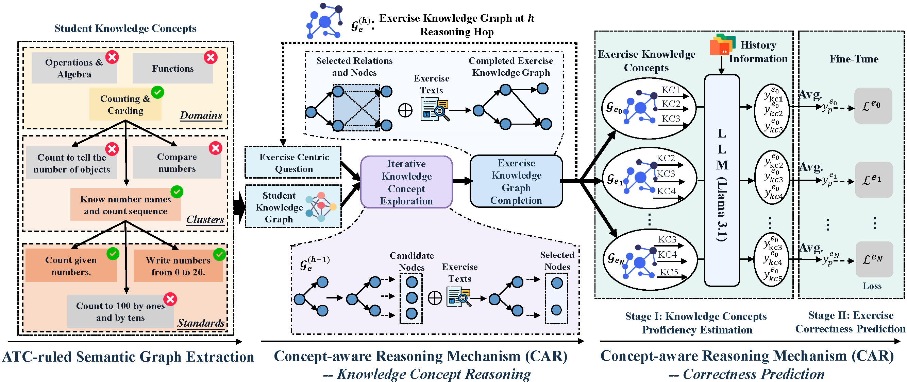

# SKG_KT
This is the demo code for the paper: SKG-KT: Semantic Knowledge Graph Construction and Reasoning for Knowledge Tracing by Large Language Models

# Model Structure


# Package Requirements
Please refer to the requirements.txt in the code.

# Training 
```python
python train_skgkt.py train
```
# Prompts
Please refer to the prompts.py

# Datasets
This paper includes two datasets: the XES3G5MS and MOOCRadar. For the XES3G5MS, you can refer to the paper: "Xes3g5m: A knowledge tracing
benchmark dataset with auxiliary information."[1] to download this dataset. For the MOOCRadar, you can refer to the paper: "Moocradar: A
fine-grained and multi-aspect knowledge repository for improving cognitive student modeling in moocs."[2] to download this dataset. 

# Reference papers
[1]Liu, Zitao, et al. "Xes3g5m: A knowledge tracing benchmark dataset with auxiliary information." Advances in Neural Information Processing Systems 36 (2023): 32958-32970. 

[2]Yu, Jifan, et al. "MoocRadar: A fine-grained and multi-aspect knowledge repository for improving cognitive student modeling in MOOCs." Proceedings of the 46th International ACM SIGIR Conference on Research and Development in Information Retrieval. 2023.
